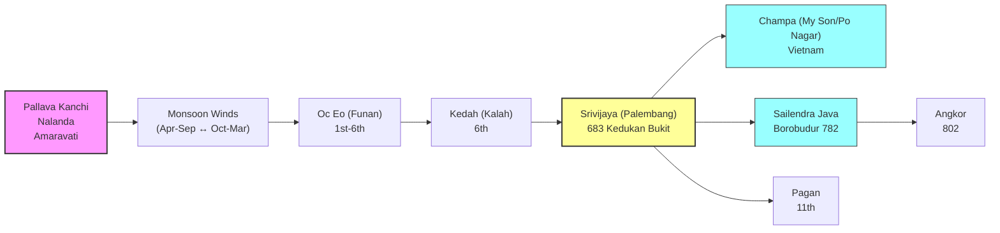

# Spread Map — How Indianization Traveled

```mermaid
flowchart LR
    India["Pallava Kanchi<br/>Nalanda<br/>Amaravati"]
    Monsoon["Monsoon Winds<br/>(Apr-Sep ↔ Oct-Mar)"]
    OcEo["Oc Eo (Funan)<br/>1st-6th"]
    Kedah["Kedah (Kalah)<br/>6th"]
    Srivijaya["Srivijaya (Palembang)<br/>683 Kedukan Bukit"]
    Champa["Champa (My Son/Po Nagar)<br/>Vietnam"]
    Java["Sailendra Java<br/>Borobudur 782"]
    Angkor["Angkor<br/>802"]
    Pagan["Pagan<br/>11th"]

    India --> Monsoon --> OcEo --> Kedah --> Srivijaya
    Srivijaya --> Champa
    Srivijaya --> Java
    Java --> Angkor
    Srivijaya --> Pagan

    style India fill:#f9f,stroke:#333,stroke-width:2px
    style Srivijaya fill:#ff9,stroke:#333,stroke-width:2px
    style Champa fill:#9ff,stroke:#333
    style Java fill:#9ff,stroke:#333
```

> **Kepano pattern:** Keep this map linked from `Dashboard.md` and each `regions/*/README.md`.
